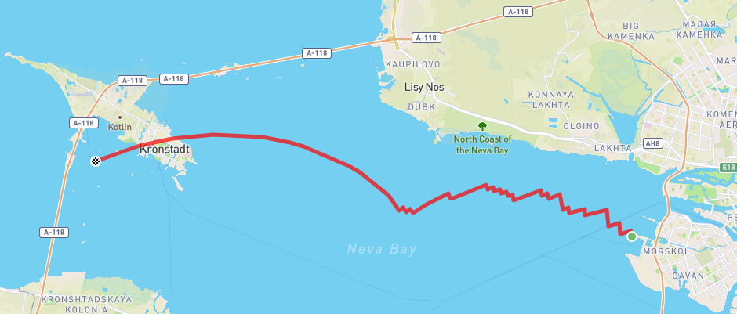
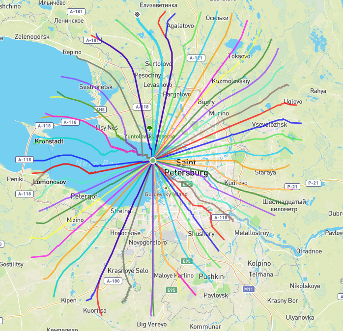
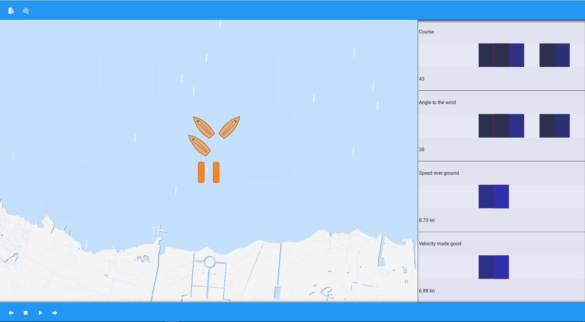

<p style="display:inline-block">
  <a href="https://www.python.org/downloads/release/python-3110/">
    
  </a>
  <a href="https://github.com/kivy/kivy">
    
  </a>
  <a href="https://pypi.org/project/geovectorslib/">
    
  </a>
  <a href="https://github.com/numpy/numpy">
    
  </a>
  <a href="https://github.com/scipy/scipy">
    
  </a>
  <a href="https://github.com/opencv/opencv-python">
    
  </a>
  <a href="https://github.com/nidhaloff/gpx-converter">
    
  </a>
  <a href="https://github.com/ecmwf/eccodes">
    
  </a>
  <a href="https://pypi.org/project/cfgrib/">
    
  </a>
</p>

# SmartSkipper
В папке project находится проект “Генерация GPX файлов парусных гонок и алгоритм поиска самого быстрого маршрута парусного судна”

- Генерация файлов происходит в соответствии с правилами парусных гонок.\
  Ставится два стартовых знака перпендикулярно ветру, а также ставится верхний знак против ветра на некотором расстоянии. После этого лодки идут в лавировку от стартовых до верхнего знака, а затем спускаются до стартового знака и финишируют. При движении вниз по ветру лодка может идти курсом фордевинд (строго вниз по ветру) или курсом бакштаг (под некоторым углом к ветру).\
  После чего парусная гонка сохраняется в формате GPX.\
- Алгоритм поиска самого быстрого маршрута основан на методе изохрон, то есть формируется изохрона –  линия, показывающая точки с одинаковым временем достижения из заданного места. Скорость движения     парусного судна – функция от ветра и характеристик лодки.\
  Для получения информации о ветре используются прогнозы [Global Forecast System](https://www.ncei.noaa.gov/products/weather-climate-models/global-forecast),  представляющие из себя GRIB файлы.\
  Для получения информации о характеристиках парусного судна используются полярные графики скоростей в формате CSV. Пример работы алгоритма для поиска кратчайшего пути на скриншотах ниже.

  <p align="center">
     
    <p align="center"> Рисунок 1 - Построенный оптимальный маршрут <p>
  </p>
  <p align="center">
    
    <p align="center"> Рисунок 2 - Изохроны, использующиеся для вычисления оптимального маршрута <p>
  </p>


В папке coursework находится приложение Smartskipper.

- Smartskipper - приложение для анализа ваших тренировок и гонок в мире парусного спорта. Загружайте ваши треки и узнайте, где вы бы могли стать быстрее. Приложение позволяет вывести на ваш экран такие характеристики как: Course (курс движения), Angle to the wind (угол движения к ветру), Course Over Ground (скорость движения), Velocity Made Good (скорость продвижения вверх по ветру). Пример на скриншоте ниже.
 
  <p align="center">
    
    <p align="center"> Рисунок 3 - Сгенерированная гонка и отображение параметров <p>
  </p>

Для запуска проекта потребуются библиотеки, которые можно установить при помощи команд:
```
pip install kivy
pip install kivymd
pip install kivy-Garden
pip install kivy-garden.mapview
pip install geovectorslib
pip install numpy
pip install SciPy
pip install opencv-python
pip install gpx-converter
pip install eccodes
pip install cfgrib
```
